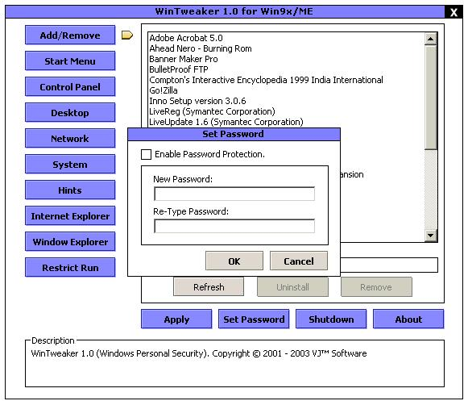



## WinTweaker

### Description

This program (WinTweaker) is a security tool for your Windows OS, tested in Windows 98 and Windows ME (Millenium Edition)... also run in Windows 2000 and Windows XP but have some limitations. It can hide/show, enable/disable and change some Windows settings.

I would like to thanx Planet-Source-Code.Com and to my fellow programmers for sharing some knowledge here. Some code in this programs is not mine and I also would like to thanx to the authors of that code (sorry... i forgot your names names Bros). Thanx A Lot Again Bros... Happy Coding... :)

If you like this program and can help you or you think its usefull... then THANX... please VOTE :)

*USE THIS AT YOUR OWN RISK.
 
### More Info
 

             |
---                |---
**Submitted On**   |2003-03-28 03:10:00
**By**             |[Vanni Alora](https://github.com/Planet-Source-Code/PSCIndex/blob/master/ByAuthor/vanni-alora.md)
**Level**          |Intermediate
**User Rating**    |4.8 (29 globes from 6 users)
**Compatibility**  |VB 6\.0
**Category**       |[Registry](https://github.com/Planet-Source-Code/PSCIndex/blob/master/ByCategory/registry__1-36.md)
**World**          |[Visual Basic](https://github.com/Planet-Source-Code/PSCIndex/blob/master/ByWorld/visual-basic.md)
**Archive File**   |[WinTweaker1572754122003\.zip](https://github.com/Planet-Source-Code/vanni-alora-wintweaker__1-44696/archive/master.zip)

